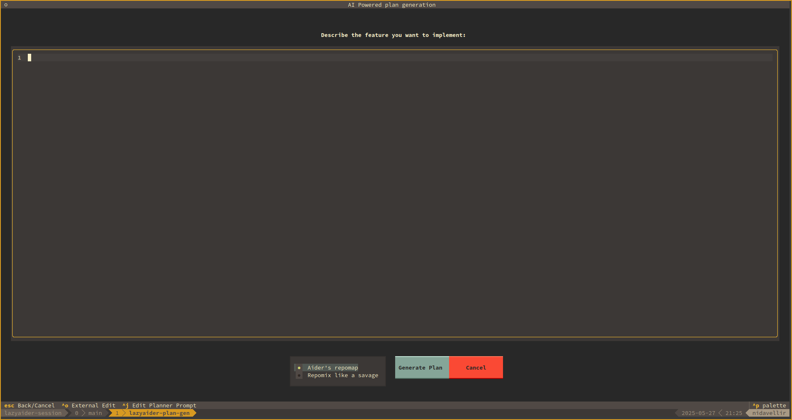

# LazyAider: Your AI-Powered Coding Companion

LazyAider is a terminal-based tool designed to streamline your development workflow by integrating with tmux and leveraging Large Language Models (LLMs) to help you plan and execute coding tasks. It provides a persistent, session-based environment where you can generate development plans from feature descriptions, manage these plans, and interact with your codebase efficiently.

<!-- Placeholder for a general overview screenshot -->
<!--  -->

## Features

*   **Seamless Tmux Integration**: LazyAider automatically manages tmux sessions, providing a dedicated and organized workspace with a main shell pane and a sidebar for the LazyAider application.
*   **Interactive Session Management**:
    *   Easily select from existing managed sessions.
    *   Create new sessions with unique names.
    *   Rename sessions directly from the selector.
    *   Configuration is automatically updated to reflect session changes.
*   **AI-Powered Plan Generation**:
    *   Describe a feature or task in natural language.
    *   LazyAider (via `plan_generator.py`) interacts with an LLM to break down the description into a step-by-step actionable plan.
    *   Review and modify the default planner prompt (`.lazyaider/planner_prompt.md`) directly within the plan generation TUI (Ctrl+J).
    *   Plans are saved as markdown files for review and use.
*   **Interactive Task Sidebar**:
    *   The main LazyAider interface is a Textual sidebar application running within a tmux pane.
    *   View and navigate through the sections of your active development plan.
    *   Send plan sections or custom instructions to your shell.
    *   Mark sections as complete.
    *   The "Start Aider" button will first look for an `aider.sh` script in the current working directory and execute it if present. If not found, it will run the `aider` command.
*   **Plan & Section Editing**:
    *   Edit feature descriptions or individual plan sections using a built-in interface or an external text editor.
*   **Configuration**:
    *   Customize LazyAider through a `.lazyaider.conf.yml` file.
    *   Settings include LLM model, API key, UI theme, preferred text editor, and more.
*   **Context-Aware Operations**: Utilizes repository maps (e.g., via Aider or repomix) to provide context to the LLM for more relevant plan generation.

## Screenshots

### Session Selector:


*The session selector allows you to pick an existing session or create/rename sessions.*

### Main Sidebar UI:


*The LazyAider sidebar showing an active plan within a tmux session.*

### Plan Generation:



*Inputting a feature description to generate a development plan.*

## Installation

1.  **Clone the repository:**
    ```bash
    git clone https://github.com/yourusername/lazyaider.git # Replace with your actual repo URL
    cd lazyaider
    ```
2.  **Create a virtual environment (recommended):**
    ```bash
    python -m venv venv
    source venv/bin/activate  # On Windows use `venv\Scripts\activate`
    ```
3.  **Install LazyAider:**
    *   For users:
        ```bash
        pip install .
        ```
    *   For developers (editable install):
        ```bash
        pip install -e .
        ```
4.  **Configuration:**
    *   LazyAider looks for a configuration file named `.lazyaider.conf.yml` in the root of the project. You may need to create this file or configure settings like your LLM API key.
    *   Key settings you might want to configure:
        *   `llm_model`: The LLM model to use (e.g., "gpt-4-turbo").
        *   `llm_api_key`: Your API key for the LLM provider.
        *   `text_editor`: Command to launch your preferred external text editor (e.g., "code -w" or "nvim").

## Usage

### Main Application (`lazyaider.py`)

To start LazyAider and manage your development sessions, run the installed command:

```bash
lazyaider
```
Alternatively, you can still run it directly using `python lazyaider.py` from the project directory.

*   If you have existing managed sessions, the **Session Selector** will appear, allowing you to choose a session, create a new one, or rename an existing one.
*   If no managed sessions are found, LazyAider will propose creating a new default session (e.g., `lazyaider-session`).
*   Once a session is selected or created, LazyAider will set up a tmux session (if it doesn't already exist) with two panes:
    *   A main shell pane where you can run commands.
    *   A sidebar pane running the LazyAider Textual application, which displays your task list/plan.

**Command-Line Options for `lazyaider.py`:**

*   `--load-session <SESSION_NAME>`
    *   Directly loads the specified tmux session, bypassing the session selector.
    *   If the session `SESSION_NAME` is not already in the LazyAider configuration, it will be added.
    *   This is useful for scripting or quickly jumping back into a known session.

    Example:
    ```bash
    lazyaider --load-session my-project-session
    ```

Internal command-line arguments used for tmux integration (e.g., `--run-in-tmux-pane`, `--target-pane`, `--session-name` when launching the app pane itself) are not intended for direct user interaction when calling `lazyaider` as an installed script.

### Plan Generation

To generate a development plan from a feature description, use the `lazyaider-plan-generator` command:

```bash
lazyaider-plan-generator
```
When run without arguments, this script will launch an interactive Textual application to input the feature description.

Alternatively, you can use it non-interactively:

**Command-Line Options for `lazyaider-plan-generator`:**

*   `--plan-file <PATH_TO_DESCRIPTION_FILE>`
    *   Path to a text file containing the feature description for non-interactive plan generation.
    *   If this option is used, the interactive input app will be skipped.

    Example:
    ```bash
    lazyaider-plan-generator --plan-file ./feature_ideas/new_auth_system.txt
    ```

*   `--dump-prompt <PATH_TO_SAVE_PROMPT>`
    *   Path to a file where the full LLM prompt (used for plan generation) should be saved.
    *   This is only used in non-interactive mode (i.e., when `--plan-file` is specified).
    *   Useful for debugging or understanding the context provided to the LLM.

    Example:
    ```bash
    lazyaider-plan-generator --plan-file feature.txt --dump-prompt prompt_output.txt
    ```

*   `--use-repomix`
    *   Use 'repomix' to generate the repository map instead of Aider's internal method.
    *   This is only used in non-interactive mode.
    *   `repomix` must be installed and accessible in your PATH.

    Example:
    ```bash
    lazyaider-plan-generator --plan-file feature.txt --use-repomix
    ```

Generated plans are saved in the `.lazyaider/plans/` directory, organized by a sanitized version of the plan's title.

## Configuration File

LazyAider uses a configuration file named `.lazyaider.conf.yml` located in the project's root directory. This YAML file stores settings such as:

*   `llm_model`: Specifies the language model to be used for plan generation.
*   `llm_api_key`: Your API key for the chosen language model provider.
*   `theme_name`: Theme for the Textual application (e.g., "light", "dark").
*   `text_editor`: The command to launch your preferred external text editor for editing plan sections or descriptions (e.g., `nvim`, `code --wait`).
*   `managed_sessions`: A dictionary storing information about sessions managed by LazyAider, including the active plan for each session.
*   `plan_generation_prompt_override_path`: Optional path to a custom prompt template file. This can be set globally or per session.
    *   **If set (and the file exists), this template will be used by the planner, taking precedence over default prompt.**
    *   The TUI prompt editor (Ctrl+J) edits `.lazyaider/planner_prompt.md`. For these TUI edits to be used by the planner, ensure `plan_generation_prompt_override_path` is *not* set (or is null/empty) in your `.lazyaider.conf.yml` for the relevant scope (global or session).
    *   If `.lazyaider/planner_prompt.md` does not exist when initiating TUI editing, its content will be initialized from the global `plan_generation_prompt_override_path` (if set and valid), otherwise from the default built-in template.

Example snippet from `.lazyaider.conf.yml`:
```yaml
llm_model: "gpt-4-turbo"
llm_api_key: "sk-your_api_key_here" # Store securely!
theme_name: "dark"
text_editor: "nvim"
managed_sessions:
  lazyaider-session:
    active_plan_name: "implement-user-auth"
  another-project:
    active_plan_name: null
plan_generation_prompt_override_path: null # or "path/to/custom_prompt.txt"
```

## License

Distributed under the MIT License. See `LICENSE` for more information.
(Note: You'll need to add a LICENSE file to your project if you don't have one).
